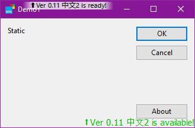

# Updater

A software update solution that uses a git repository as an update server

## How to Use

After the program starts, the function `VersionMessageWin_Create` exported in `UpdateService.dll` can be called to enable the software to support the update online:

```cpp
LRESULT CMainDlg::OnShow(UINT, WPARAM, LPARAM, BOOL&)
{
	VersionMessageWin_Create(m_hWnd);
	return 0;
}
```

That's all



It is required to have the `update` folder in the same folder of the program, and put the `updater.exe` and `update.cfg` files in it. The `update.cfg` file defines the location of the update server:

```yaml
git:
  remote: file:///C:/test/update/repo/.git
  branch: master
  local: ..
```

- `remote` is the GIT repository location, can be HTTP or local repository
- `branch` is a branch of the GIT repository
- `local` is the local folder location to update

> Please refer to the DEMO project to see more details.

## Build with Conan

1. Add a profile called "mt64"

```ini
[settings]
os=Windows
os_build=Windows
arch=x86_64
arch_build=x86_64
compiler=Visual Studio
compiler.version=16
compiler.runtime=MT
build_type=Release
[options]
[build_requires]
[env]
```

2. Create a folder in source folder, let's say: "rel64"

```bash
mkdir rel64
cd rel64
conan install .. --profile mt64 --build=libgit2
```

3. Add `rel64\conanbuildinfo.props` to project in "Property Manager"
