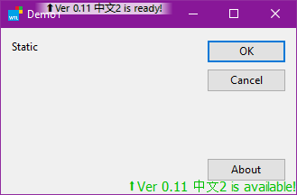

# Updater

A software update solution that uses a git repository as an update server

## How to Use

After the program starts, the function `VersionMessageWin_Create` exported in `UpdateService.dll` can be called to enable the software to support the update online:

```cpp
LRESULT CMainDlg::OnShow(UINT, WPARAM, LPARAM, BOOL&)
{
	VersionMessageWin_Create(m_hWnd);
	return 0;
}
```

That's all



It is required to have the `update` folder in the same folder of the program, and put the `updater.exe` and `update.cfg` files in it. The `update.cfg` file defines the location of the update server:

```yaml
git:
  remote: file:///C:/test/update/repo/.git
  branch: master
  local: ..
```

- `remote` is the GIT repository location, can be HTTP or local repository
- `branch` is a branch of the GIT repository
- `local` is the local folder location to update

> Please refer to the DEMO project to see more details.

## Build with VCPKG

1. Install and integrate [VCPKG](https://github.com/microsoft/vcpkg), (tips: Visual Studio 2022 has inculded VCPKG, you can run it under `Developer Command Prompt`)
2. Currect version of VCPKG cannot build libgit2, we have to manually build it, see `build-libgit2.bat`. (Add libgit2 into vcpkg.json is recommended once VCPKG fix it)
3. Open with VS, Build ...
